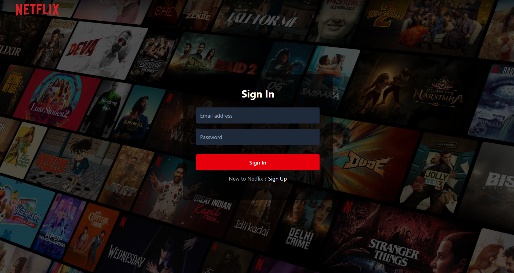
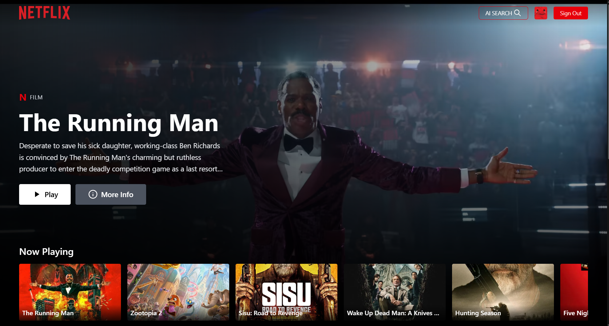
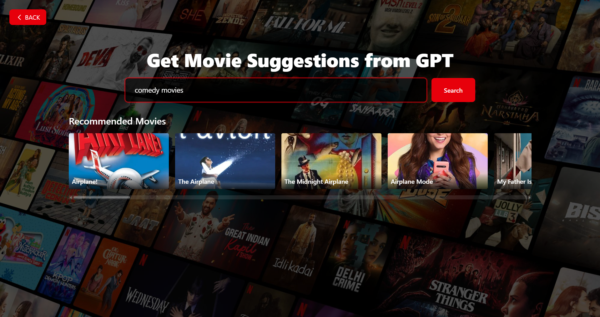

# 🎬 Netflix GPT

A Netflix clone with AI-powered movie recommendations using OpenAI's GPT and TMDB API. Browse movies, watch trailers, and get personalized movie suggestions powered by artificial intelligence.





---

## 📋 Table of Contents
- [Features](#features)
- [Tech Stack](#tech-stack)
- [Prerequisites](#prerequisites)
- [Installation & Setup](#installation--setup)
- [Configuration](#configuration)
- [Running the Application](#running-the-application)
- [Project Structure](#project-structure)
- [How It Works](#how-it-works)
- [Troubleshooting](#troubleshooting)

---

## ✨ Features

### 🔐 Authentication
- User Sign Up with email and password
- User Sign In with validation
- Profile management (display name & picture)
- Secure logout functionality
- Protected routes (redirects based on auth status)

### 🎥 Browse Movies
- **Main Container**: Featured movie with background trailer
- **Movie Categories**: Now Playing, Popular, Top Rated, Upcoming
- Auto-playing muted trailers
- Responsive movie cards with posters
- Smooth scrolling movie lists

### 🤖 Netflix GPT (AI Search)
- AI-powered movie search using OpenAI GPT
- Natural language queries (e.g., "funny romantic comedies")
- Intelligent movie suggestions based on your search
- Integration with TMDB for real movie data

---

## 🛠️ Tech Stack

- **Frontend**: React 18, Tailwind CSS
- **State Management**: Redux Toolkit
- **Authentication**: Firebase Authentication
- **APIs**: TMDB API, OpenAI API
- **Routing**: React Router DOM
- **Deployment**: Firebase Hosting
- **Hooks**: Custom hooks for data fetching

---

## 📦 Prerequisites

Before you begin, make sure you have the following installed:

- **Node.js** (version 14 or higher) - [Download here](https://nodejs.org/)
- **npm** or **yarn** package manager
- A code editor (VS Code recommended)
- Git for cloning the repository

---

## 🚀 Installation & Setup

### Step 1: Clone the Repository

```bash
git clone <your-repository-url>
cd netflix-gpt
```

### Step 2: Install Dependencies

```bash
npm install
```

or if you use yarn:

```bash
yarn install
```

### Step 3: Set Up Firebase

1. Go to [Firebase Console](https://console.firebase.google.com/)
2. Create a new project
3. Enable **Authentication** → **Email/Password** sign-in method
4. Go to Project Settings → General → Your apps
5. Register a web app and copy the Firebase configuration

### Step 4: Set Up TMDB API

1. Visit [TMDB Website](https://www.themoviedb.org/)
2. Create an account and verify your email
3. Go to Settings → API → Create → Developer
4. Fill out the API form and submit
5. Copy your **API Key** and **Access Token**

### Step 5: Set Up OpenAI API

1. Visit [OpenAI Platform](https://platform.openai.com/)
2. Sign up or log in
3. Go to API Keys section
4. Create a new secret key
5. Copy and save it securely (you won't see it again!)

---

## ⚙️ Configuration

### Create Environment File

Create a `.env` file in the root directory:

```env
REACT_APP_FIREBASE_API_KEY=your_firebase_api_key
REACT_APP_FIREBASE_AUTH_DOMAIN=your_project.firebaseapp.com
REACT_APP_FIREBASE_PROJECT_ID=your_project_id
REACT_APP_FIREBASE_STORAGE_BUCKET=your_project.appspot.com
REACT_APP_FIREBASE_MESSAGING_SENDER_ID=your_sender_id
REACT_APP_FIREBASE_APP_ID=your_app_id

REACT_APP_TMDB_KEY=your_tmdb_api_key
REACT_APP_TMDB_ACCESS_TOKEN=your_tmdb_access_token

REACT_APP_OPENAI_KEY=your_openai_api_key
```

### Update .gitignore

Make sure your `.env` file is in `.gitignore`:

```
# Environment variables
.env
.env.local
.env.production
```

---

## 🏃 Running the Application

### Development Mode

```bash
npm start
```

The app will open at `http://localhost:3000`

### Build for Production

```bash
npm run build
```

This creates an optimized production build in the `build` folder.

### Deploy to Firebase

```bash
# Install Firebase CLI globally (one-time setup)
npm install -g firebase-tools

# Login to Firebase
firebase login

# Initialize Firebase (if not already done)
firebase init

# Deploy
firebase deploy
```

---

## 📁 Project Structure

```
netflix-gpt/
├── public/
├── src/
│   ├── components/
│   │   ├── Header.js
│   │   ├── Login.js
│   │   ├── Browse.js
│   │   ├── MainContainer.js
│   │   ├── SecondaryContainer.js
│   │   ├── MovieList.js
│   │   ├── MovieCard.js
│   │   └── GPTSearch.js
│   ├── hooks/
│   │   ├── useNowPlayingMovies.js
│   │   ├── usePopularMovies.js
│   │   ├── useTopRatedMovies.js
│   │   └── useUpcomingMovies.js
│   ├── utils/
│   │   ├── appStore.js
│   │   ├── userSlice.js
│   │   ├── movieSlice.js
│   │   ├── gptSlice.js
│   │   ├── firebase.js
│   │   └── constants.js
│   ├── App.js
│   └── index.js
├── .env
├── .gitignore
├── package.json
└── tailwind.config.js
```

---

## 🎯 How It Works

### Authentication Flow
1. User visits the site → Redirected to Login page
2. User signs up with email/password → Firebase creates account
3. User signs in → Firebase validates credentials
4. On success → Redirected to Browse page
5. User data stored in Redux store
6. Protected routes check authentication status

### Movie Browsing
1. Custom hooks fetch movie data from TMDB API
2. Data stored in Redux movie slice
3. MainContainer displays featured movie with trailer
4. SecondaryContainer shows categorized movie lists
5. Movie cards display posters from TMDB CDN
6. Click on movies for more details

### GPT Search
1. User enters natural language query
2. OpenAI GPT processes the query
3. GPT suggests relevant movie names
4. App searches TMDB for those movies
5. Results displayed using reusable MovieList component

---

## 🐛 Troubleshooting

### Common Issues

**Issue**: `npm start` fails
- **Solution**: Delete `node_modules` and `package-lock.json`, then run `npm install` again

**Issue**: Firebase authentication not working
- **Solution**: Check if Email/Password auth is enabled in Firebase Console

**Issue**: Movies not loading
- **Solution**: Verify your TMDB API key is correct in `.env` file

**Issue**: GPT search not working
- **Solution**: 
  - Check OpenAI API key validity
  - Ensure you have credits in your OpenAI account
  - Verify API key has proper permissions

**Issue**: Build fails
- **Solution**: Check for console errors, ensure all environment variables are set

### Need Help?

If you encounter any issues:
1. Check the browser console for errors
2. Verify all API keys are correctly set in `.env`
3. Ensure all dependencies are installed
4. Check Firebase and TMDB dashboard for API limits

---

## 🎓 Learning Resources

- [React Documentation](https://react.dev/)
- [Firebase Docs](https://firebase.google.com/docs)
- [TMDB API Docs](https://developer.themoviedb.org/docs)
- [Tailwind CSS](https://tailwindcss.com/docs)
- [Redux Toolkit](https://redux-toolkit.js.org/)

---

## 📝 Development Checklist

- [x] Create React App with Tailwind CSS
- [x] Set up routing and navigation
- [x] Build authentication (Sign Up/Sign In)
- [x] Implement form validation with useRef
- [x] Configure Firebase Authentication
- [x] Set up Redux store with user and movie slices
- [x] Integrate TMDB API for movie data
- [x] Create custom hooks for data fetching
- [x] Build main and secondary containers
- [x] Implement video trailer functionality
- [x] Design responsive UI with Tailwind
- [x] Add GPT-powered search feature
- [x] Implement movie suggestions
- [x] Add memoization for performance
- [x] Configure environment variables
- [x] Deploy to production

---

## 🚀 Ready to Start?

1. Complete all setup steps above
2. Run `npm start`
3. Sign up for a new account
4. Start browsing movies!
5. Try the GPT search for AI-powered recommendations

**Happy coding! 🎉**